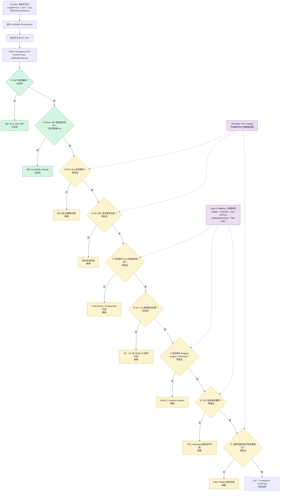
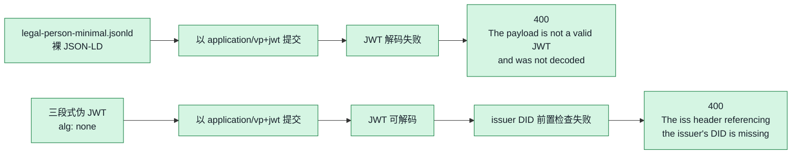
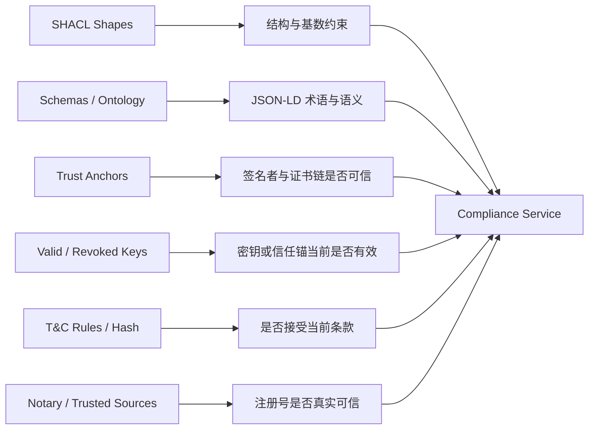
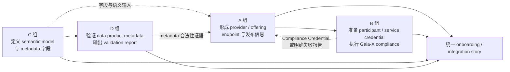

# B 组 — Gaia-X Validation Flow

> 对应任务计划 B4：输出 Gaia-X compliance / validation flow  
> 场景：Building Energy Consumption Data Product  
> 文档状态：初稿整合版  
> 更新日期：2026-07-21

## 1. 文档目的与结论

本文说明 `Energy Data Provider Ltd.` 的 participant credential 如何进入 Gaia-X Compliance Service、验证服务可能依次检查哪些内容、Registry 在后续验证中提供什么，以及 B 组现有实验实际走到了哪一步。

本轮研究的核心结论是：

1. Compliance API 的输入不是裸 JSON-LD credential，而是签名后的 VP-JWT。
2. B 组已实测 JWT 解码和 `iss` 前置检查；裸 JSON-LD 返回 `not a valid JWT`，三段式伪 JWT 返回 `iss header ... missing`。
3. 当前实验没有进入 DID 解析、签名、Trust Anchor、SHACL、T&C 或 Notary 校验，因此这些阶段只能依据现有研究整理为“待验证流程”，不能写成 API 实测结果。
4. Registry 是后续结构规则和信任规则的来源，但当前两个实际错误都发生在 Registry 参与之前。
5. 缺少可解析 DID、签名密钥/证书链、LRN credential 和 T&C credential 时，B 组可以完成流程设计和前置失败 demo，但不能完成深层验证或获得 Compliance Credential。

### 状态标记

| 标记 | 含义 |
|---|---|
| **已实测** | B 组已向 Compliance API 提交请求并保存了返回结果 |
| **已准备，未触发** | 已准备 credential 内容或错误变体，但因前置层失败而未被 API 检查 |
| **待验证** | 依据 Task 1、Task 3 和 Gaia-X 资料整理的后续环节，尚未由本组 API 实验证明 |
| **外部依赖** | 需要项目负责人、真实身份材料或外部 Gaia-X 服务支持 |

---

## 2. 验证对象、输入与输出

### 2.1 场景中的验证对象

本组选择 LegalPerson 作为最小研究对象，用它描述数据提供方：

| 项目 | 当前值 |
|---|---|
| Provider | `Energy Data Provider Ltd.` |
| Credential 类型 | `gx:LegalPerson` |
| 示例 issuer | `did:web:energy-provider.example.org` |
| 当前 credential | `任务结果/legal-person-minimal.jsonld` |
| 当前状态 | 裸 JSON-LD；无真实 proof；issuer DID 为占位值 |

完整 participant 合规输入通常还需要 Legal Registration Number（LRN）credential、Terms and Conditions（T&C）credential，以及能验证签名和身份的 DID、公钥或证书链。若验证 ServiceOffering，还需要 participant 与 service offering 之间的有效引用关系。

### 2.2 Compliance API 的输入与输出

| 项目 | 内容 | 当前状态 |
|---|---|---|
| 请求方式 | `POST` | 已实测 |
| Content-Type | `application/vp+jwt` | 已实测 |
| 请求体 | 已签名的 Verifiable Presentation，即 VP-JWT 字符串 | 当前缺失 |
| 查询参数 | `vcid` | 已实测 |
| 成功结果 | `201`，返回 Compliance Credential（VC-JWT） | 未获得 |
| 失败结果 | 错误状态码和 validation error | 已获得前置错误 |

本组使用过的 Gaia-X Lab 入口包括：

- `POST https://compliance.lab.gaia-x.eu/development/api/credential-offers/standard-compliance?vcid={id}`
- `POST https://compliance.lab.gaia-x.eu/main/api/credential-offers/standard-compliance?vcid={id}`

API 实测记录日期为 2026-07-01（UTC+8）。端点可用性和接口要求会变化，后续复测时应重新核对当前 Swagger/API 文档。

---

## 3. Gaia-X 验证主流程

下图同时展示 Provider 的凭证准备、Compliance Service 的验证阶段、Registry/外部信任来源，以及成功和失败出口。

> 注意：图中的 JWT 解码与 `iss` 检查为**已实测**；其余验证阶段为依据现有研究整理的**待验证目标流程**。箭头表示便于研究和排错的逻辑顺序，不代表本组已通过 API 证明了所有内部实现顺序。

### 3.1 最直白的解释

可以把这条流程理解成进入一栋有多道门禁的建筑：

1. 第一扇门只看提交物是不是 JWT。
2. 第二扇门看 JWT 有没有说明“是谁签发的”。
3. 后面的门才会检查这个身份能否查询、签名是否正确、签名者是否可信、credential 内容是否符合规则、是否接受条款、注册号是否真实。

B 组当前实际通过了“伪 JWT 能被解码”这一步，但在第二扇门因缺少 `iss` 被拒绝。当前还没有证据证明 API 检查了凭证内部字段。

---

## 4. 当前实验实际走过的路径

### 4.1 实测结果矩阵

| 测试输入 | Content-Type | 实际结果 | 能证明什么 | 不能证明什么 |
|---|---|---|---|---|
| 裸 JSON-LD | `application/json` | `500 stream is not readable` | 该调用方式不被当前服务正确处理 | 不能说明 credential 内容是否合规 |
| 最小 LegalPerson 裸 JSON-LD | `application/vp+jwt` | `400 not a valid JWT` | API 要求 JWT，而不是裸 JSON-LD | 未触发 SHACL、Trust Anchor 等后续验证 |
| 缺字段版裸 JSON-LD | `application/vp+jwt` | 同样返回 `400 not a valid JWT` | JWT 前置层不会区分内部字段差异 | 未实测 `sh:minCount` 错误 |
| 格式错误版裸 JSON-LD | `application/vp+jwt` | 同样返回 `400 not a valid JWT` | JSON-LD 内容尚未被处理 | 未实测 context、日期或 country code 错误 |
| 三段式伪 JWT | `application/vp+jwt` | `400 iss header ... missing` | 请求已越过 JWT 解码，服务随后检查 issuer DID 信息 | 未触发 DID、签名、Trust Anchor、SHACL 等验证 |

### 4.2 对本轮 demo 的准确表述

本轮 demo 是一个**可复现的前置失败 demo**：它证明 Gaia-X Compliance API 要求 VP-JWT，并会在进一步处理前检查 issuer DID 信息。

本轮 demo 不是完整的 Gaia-X compliance validation，也不是 LegalPerson SHACL validation。`legal-person-minimal.jsonld`、缺字段版和格式错误版之间的内容差异，尚未被 Compliance API 实际比较。

---

## 5. Registry 在后续验证中的作用

Registry 与 Compliance Service 的关系可以概括为：Compliance Service 执行验证，Registry 提供后续验证所依据的结构规则和信任信息。并非所有错误都来自 Registry；Content-Type、JWT 解码和缺少 `iss` 都属于 Registry 前置问题。

| 后续校验对象 | Registry 或信任资源的作用 | 当前场景可能出现的问题 | 证据状态 |
|---|---|---|---|
| LegalPerson shape | 检查必填属性、类型和 cardinality | 缺 `gx:registrationNumber`、`gx:headquartersAddress`、`gx:legalAddress` | 已准备错误变体，API 未触发 |
| Address shape | 检查地址字段及 country code 等约束 | `countryCode = "China"` 可能不满足要求 | 已准备错误变体，API 未触发 |
| Schema / ontology | 解释 `gx:LegalPerson` 等 JSON-LD 术语 | 错误 `@context` 可能导致 JSON-LD 处理失败 | 已准备错误变体，API 未触发 |
| Trust Anchors | 判断签名者、证书链或可信来源是否可接受 | 当前没有可信证书链 | 待验证；外部依赖 |
| Valid / revoked keys | 判断密钥、证书或 anchor 当前是否仍有效 | 当前没有可检查的真实 key | 待验证；外部依赖 |
| T&C rules | 检查 issuer 是否接受要求的条款版本 | 当前缺少 T&C credential | 待验证；外部依赖 |
| Notary / registration source | 核验 Legal Registration Number | 当前注册号引用为教学占位值 | 待验证；外部依赖 |

因此，当前实际 API 失败不能归因于某个 Registry shape 或 Trust Anchor。只有在提交格式正确、issuer 信息完整且签名可验证的 VP-JWT 后，Registry 相关规则才可能成为直接失败原因。

---

## 6. 三类 credential 样例在流程中的预期表现

| 样例 | 当前实际结果 | 若成功进入内容验证，可能的后续结果 |
|---|---|---|
| `legal-person-minimal.jsonld` | 裸 JSON-LD，在 JWT 解码层失败 | LegalPerson 基础字段可能满足 shape；仍可能因 DID、签名、Trust Anchor、T&C、LRN/Notary 失败 |
| 缺字段变体 | 同样在 JWT 解码层失败 | 可能出现三个必填属性的 `sh:minCount` violations |
| 格式错误变体 | 同样在 JWT 解码层失败 | 错误 context 可能导致 JSON-LD 处理失败；country code 等内容可能导致 shape violation |

这里使用“可能”而不是“将会”，因为 B 组没有用 signed VP-JWT 实际到达这些验证阶段，且后续服务实现、规则版本及错误返回格式可能变化。

---

## 7. 与 A、C、D 组的接口

B 组负责 participant / service offering 的 trust 与 compliance；它与 D 组的数据产品 metadata SHACL validation 是两个不同的验证对象，不能把两者的 SHACL 结果混为同一次验证。

| 来源 | B 组接收的输入 | B 组用途 |
|---|---|---|
| A 组 | Provider identity、offering 名称、endpoint、service description | 填入或引用 LegalPerson / ServiceOffering credential |
| C 组 | Metadata 字段、语义模型、版本信息 | 说明 service/offering 描述与共同语义模型的对应关系 |
| D 组 | Data product metadata validation report | 作为集成流程中的独立 conformance 证据，不替代 Gaia-X participant compliance |
| 项目负责人 | 可解析 DID、签名方案、密钥/证书链、LRN、T&C 和测试准入信息 | 生成 signed VP-JWT 并推进深层验证 |

B 组向集成任务输出：

- 当前阶段：LegalPerson credential 样例、API 前置失败证据、Registry 作用说明和本 validation flow；
- 获得外部材料后：signed VP-JWT、分层错误报告，或成功返回的 Compliance Credential。

---

## 8. 从当前状态继续推进的条件

### 8.1 当前已完成

- LegalPerson 最小 credential 内容样例；
- Compliance API 入口、Content-Type 与 VP-JWT 请求格式确认；
- 裸 JSON-LD 与伪 JWT 的前置失败实验；
- Actual API errors 与 inferred Registry errors 的区分；
- Registry shapes、schemas、trust anchors、valid/revoked keys、T&C 和 Notary 作用分析；
- Gaia-X validation flow 和跨组接口框架。

### 8.2 继续深层验证所需的外部条件

1. 可公开解析的 DID:WEB 文档；
2. 与 DID 对应的签名密钥、公钥和允许使用的签名算法；
3. 可被目标环境接受的证书链或 Trust Anchor 配置；
4. 真实或获准用于测试的 LRN credential；
5. 与目标规则版本匹配的 T&C credential；
6. 当前 Gaia-X Lab 接受的 credential profile、API 版本和测试准入信息。

这些条件到位后，应按“JWT → issuer/DID → 签名 → 信任链 → VP/VC 结构 → SHACL/schema → T&C → LRN/Notary”的排错顺序逐层复测，并为每次请求保存输入、时间、端点、状态码和原始响应。

---

## 9. 验收结论

按照 taskplan 的初稿目标，本文已经给出：

- Gaia-X credential 从准备到提交、验证、返回结果的总体流程；
- Compliance Service、Registry、DID/PKI/Notary 和 Provider 的关系；
- 当前可复现 demo 在完整流程中的准确位置；
- 已实测结果与待验证推断的明确边界；
- B 组与 A/C/D 组的集成接口；
- 推进到完整 compliance validation 所需的外部依赖。

现阶段最准确的项目结论是：

> B 组已完成 Gaia-X Compliance API 的前置校验实验与完整 validation flow 初稿。实验确认 VP-JWT 格式及 issuer DID 信息是进入后续验证的前提。由于统一场景未提供可解析 DID、签名密钥/证书链、LRN 和 T&C credential，本轮尚未触发 Registry 驱动的 Trust Anchor、SHACL、key status、T&C 和 Notary 校验，也未获得 Compliance Credential。

---

## 10. 本项目参考材料

- `B_gaiax_concepts_revised_with_framework.md`：VC、VP、Self-Description、SHACL、Trust Anchor、公钥与撤销概念。
- `任务结果/B_compliance_api_demo.md`：Compliance API 请求格式、测试矩阵和实际响应。
- `B_registry_role_analysis.md`：Registry 资源及 actual / inferred errors 的区分。
- `B_gaiax_compliance_flow.md`：早期 compliance flow 架构初稿。
- `DSSC_Toolbox_Research_Task_Plan.md`：B 组任务与最终交付要求。
- `DSSC_Minimal_Energy_Scenario/README.md` 与 `VALIDATION_GUIDE.md`：统一场景、模板用途及已知边界。

