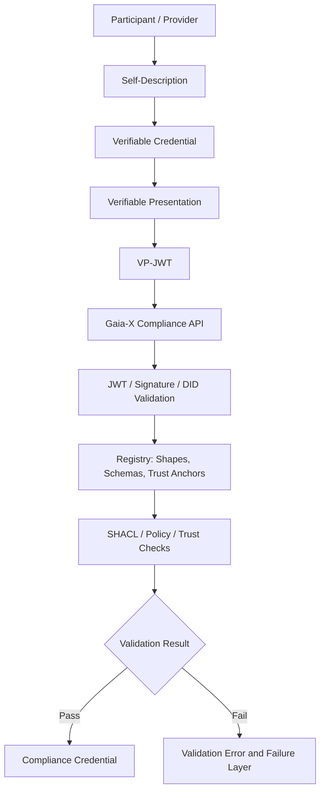
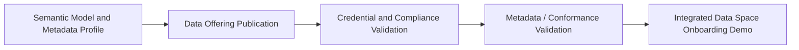

# DSSC Toolbox Group B Final Summary

> **Group B topic:** Gaia-X Compliance Service + Registry  
> **Scenario:** Building Energy Consumption Data Product  
> **Core focus:** trust, identity, credential packaging, compliance validation and failure analysis in data space onboarding

---

## 1. Project Background

This project is part of the DSSC Toolbox data space research project. The whole project uses a unified demo scenario: an energy data provider publishes a building-level hourly energy consumption data product, while a data consumer applies for access through a data space onboarding and validation process.

In this scenario, a data space is not treated as a simple data repository. The project attempts to understand how different toolbox components support the lifecycle of a data product, including semantic description, data offering publication, identity and compliance verification, and metadata validation.

Group B focuses on the **trust and compliance layer**. The central question is:

> When a data provider claims that it is a valid participant and that its service offering satisfies Gaia-X requirements, how can this claim be represented, signed, submitted, verified, and explained?

Therefore, our work does not mainly concern the actual energy data exchange. Instead, it studies how Gaia-X Self-Descriptions, Verifiable Credentials, Verifiable Presentations, Registry materials and Compliance API responses form a machine-verifiable trust chain.

---

## 2. Group Members and Task Division

| Member | College | School | Role / Responsibility |
|---|---|---|---|
| 李昊言 | 第八书院 | SAI 人工智能学院 | Group leader; repository construction, document review, cross-group coordination and data alignment |
| 王子皓 | 祥波书院 | SAI 人工智能学院 | Credential preparation and Compliance API testing |
| 马静杉 | 思廷书院 | SSE 理工学院 | Registry role analysis and credential update |
| 徐晗熙 | 厚含书院 | SDS 数据科学学院 | Concept documentation in the first stage; final summary document and integration in the second stage |

---

## 3. Research Scope of Group B

Group B studies the Gaia-X Compliance Service and Registry. The work is organized around the following concepts and components:

- **Self-Description:** structured and machine-readable description of a Gaia-X participant, service offering or resource.
- **Verifiable Credential (VC):** a signed credential that carries claims about a subject.
- **Verifiable Presentation (VP):** a package of one or more credentials submitted for verification.
- **VP-JWT / VC-JWT:** JWT-based representation used for API submission.
- **SHACL Shape:** machine-readable validation rules for JSON-LD / RDF descriptions.
- **Trust Anchor:** a trusted root or certificate-chain source accepted by Gaia-X validation.
- **Public Key / DID Document:** materials used to verify signatures and resolve issuer identity.
- **Revocation / invalidation:** mechanisms for checking whether a credential, key or trust material is no longer valid.
- **Gaia-X Registry:** the source of validation-related governance artefacts, including shapes, schemas, trust anchors and related rule materials.
- **Gaia-X Compliance Service:** the service that receives VP-JWT, verifies structure, signatures, trust chain and compliance conditions, and returns either a compliance credential or a validation error.

The intended validation logic can be summarized as follows:



---

## 4. First-stage Tasks and Outputs

The first stage focused on concept clarification and preliminary testing. Each member was assigned one task, and the outputs were recorded as Markdown documents or sample files in the GitHub repository.

| Task | Responsible Member | Description | Output |
|---|---|---|---|
| Task 1 | 徐晗熙 | Explain Verifiable Credential, Verifiable Presentation, Self-Description, SHACL Shape, Trust Anchor, public key and revocation. | `B_gaiax_concepts.md` / revised concept document |
| Task 2 | 王子皓 | Prepare a minimal participant credential or service offering credential based on Gaia-X sample credentials; test Compliance API; observe error messages and missing fields. | `B_compliance_api_demo.md` |
| Task 3 | 马静杉 | Study what the Registry provides during validation, including shapes, schemas, trust anchors, valid keys and revoked keys. | `B_registry_role_analysis.md` |
| Task 4 | 李昊言 | Build the GitHub repository, review and integrate documents, and draw the final Gaia-X compliance flow based on Tasks 1–3. | GitHub repository and integrated validation flow |

The first-stage result established the conceptual baseline of the project. At this point, the group mainly understood that a bare JSON-LD credential is not enough for Gaia-X compliance submission. The Compliance API expects a signed VP-JWT rather than a plain Self-Description file.

---

## 5. Second-stage Tasks and Outputs

The second stage moved from concept explanation to demo integration and final reporting. The responsibilities were reorganized as follows:

| Task | Responsible Member | Description | Output / Current Result |
|---|---|---|---|
| Task 1 | 李昊言 | Coordinate cross-group data, check IDs and versions, and align data used by different groups. | Cross-group data coordination and repository-level alignment |
| Task 2 | 马静杉 | Update LegalPerson and ServiceOffering credentials; prepare valid / invalid credentials and VP-JWT. | Credential update and test material preparation |
| Task 3 | 王子皓 | Execute Compliance API tests, save responses, and analyze failure layers. | API test report and response package |
| Task 4 | 徐晗熙 | Write the final summary document, integrate member outputs, summarize project outcomes and reflect on limitations. | This final summary document |

The second-stage work also involved cross-group communication with Group A, because Group B’s credential signing and DID verification had to align with the final demo identity used by the data exchange side.

The accepted demo signing identity was:

| Item | Value |
|---|---|
| DID | `did:web:shenyousota.github.io:dssc-toolbox` |
| kid | `did:web:shenyousota.github.io:dssc-toolbox#key-1` |
| Algorithm | ES256 |
| Key type | EC P-256 |
| Demo private key source | `demo/data/keys/provider-key.private.jwk.json` |
| Demo registration number | `DEMO-ENERGY-001` |
| LegalPerson validFrom | `2026-08-16T00:00:00Z` |
| LegalPerson validUntil | `2027-08-16T00:00:00Z` |
| Administrative subdivision | `CN-GD` |

The planned Group B deliverables in the second stage included:

- ES256-signed LegalPerson VC-JWT;
- ES256-signed ServiceOffering VC-JWT;
- VP-JWT composed of the two credentials;
- valid and invalid test cases;
- JWT decoding result;
- public DID resolution result;
- signature verification evidence;
- Compliance API response and failure-layer analysis.

Because this demo did not include an independently signed mock Legal Registration Number Credential, the registration number was handled as a known limitation. Group B did not claim that a Notary-signed LRN credential had been produced.

---

## 6. Repository Outputs

The Group B repository contains concept documents, validation-flow documents, Registry analysis, API test materials and generated JWT files. The main outputs are:

| File / Folder | Function |
|---|---|
| `B_gaiax_concepts_revised_with_framework.md` | Explains the main Gaia-X trust and compliance concepts with reference to the Trust Framework. |
| `B_gaiax_validation_flow.md` | Describes the expected validation path from credential preparation to Compliance Credential. |
| `B_registry_role_analysis.md` | Analyzes the role of Registry materials such as shapes, schemas, trust anchors and revocation-related information. |
| `任务结果/B_compliance_api_demo.md` | Records minimal credential design and Compliance API testing process. |
| `任务结果/failure_in_registry.md` | Maps observed or expected validation failures to different validation layers and Registry materials. |
| `任务结果/legal-person-minimal.jsonld` | Provides a minimal LegalPerson JSON-LD example for teaching and testing. |
| `任务结果/participant-fake.vp.jwt` | Provides a fake VP-JWT used to explore earlier-stage API parsing and header-level failures. |
| `任务结果/run-compliance-demo.ps1` | Provides a local PowerShell script for VP-JWT structure checking and optional Compliance API submission. |
| `任务结果/wizard-output/` | Contains generated JWT outputs, including LegalPerson, Issuer, LegalRegistrationNumber, Signed Verifiable Presentation and Compliance Verifiable Credential files. |

The repository therefore records both successful artefact generation and intermediate failure evidence. This is useful because the project did not proceed in a straight line from a valid credential to successful compliance. Instead, the validation process revealed several layers of requirements.

---

## 7. Integrated Gaia-X Compliance Flow

Based on the group outputs, the final Gaia-X compliance flow can be described in seven layers.

### 7.1 Credential Preparation

The provider first prepares structured descriptions for itself and its service offering. In the demo, the main entities are:

- LegalPerson: `Energy Data Provider Ltd.`
- ServiceOffering: energy data access service
- Dataset / Resource reference: `building-energy-hourly-v1`
- Demo registration number: `DEMO-ENERGY-001`

These descriptions need to use the agreed Gaia-X context and cross-group identifiers. In the second stage, one important cross-group correction was to replace the older dataset URI:

```text
urn:dssc:dataset:building-energy-hourly-v1
```

with the final canonical URI:

```text
https://example.org/dssc-energy/datasets/building-energy-hourly-v1
```

This step shows that compliance work depends heavily on cross-group consistency. A syntactically valid credential may still be unsuitable for the final demo if it refers to outdated identifiers.

### 7.2 Credential Signing

The Self-Descriptions are then wrapped as Verifiable Credentials and signed. The second-stage demo aligned with Group A’s signing identity:

```text
did:web:shenyousota.github.io:dssc-toolbox
```

The intended algorithm was ES256 with an EC P-256 key. This allows local verification against the public DID document and public key materials.

### 7.3 VP-JWT Packaging

The signed credentials are combined into a Verifiable Presentation. In the final two-credential design, the VP contains:

1. LegalPerson VC-JWT;
2. ServiceOffering VC-JWT.

The VP does not include a separate LRN Credential. This is a conscious demo boundary rather than an accidental omission.

### 7.4 Local JWT and Signature Checks

Before submitting to the Gaia-X Compliance API, the VP-JWT can be locally checked. The checking process includes:

- whether the token contains three JWT segments;
- whether the header uses the expected `typ`;
- whether the embedded credentials can be decoded;
- whether the embedded credentials match the downloaded credential files;
- whether the DID document can be resolved;
- whether the signature is valid against the public key.

This local step is important because it separates local packaging errors from server-side compliance errors.

### 7.5 Compliance API Submission

The VP-JWT is submitted to the Gaia-X Compliance API using the required content type:

```text
Content-Type: application/vp+jwt
```

Earlier tests showed that sending a bare JSON-LD file causes the process to fail at the JWT decoding layer. Therefore, the submission format is itself a mandatory requirement.

### 7.6 Registry-based and Trust-based Validation

After the API accepts the VP-JWT format, deeper validation layers become relevant. These include:

- JWT header validation;
- issuer DID resolution;
- signature verification;
- certificate-chain and trust-anchor validation;
- VP / VC structure validation;
- SHACL validation of the credential content;
- T&C and Legal Registration Number related checks;
- possible revocation and key validity checks.

The Registry provides relevant shapes, schemas, trust anchor information and governance artefacts. However, some failures occur before Registry-based SHACL checks are reached.

### 7.7 Compliance Result or Failure Report

The final output can be either:

- a Compliance Verifiable Credential; or
- a validation error indicating the layer where the request failed.

In the current demo, the group produced compliance-related JWT artefacts and also recorded failure cases. The final result should be interpreted as a **demo-level or lab-level validation result**, not as production-grade Gaia-X onboarding.

---

## 8. API Test Results and Failure-Layer Analysis

The second-stage API testing showed that the main test results were consistent with expectations.

The most important finding is that the “valid” credential set did not fully pass the final trust-anchor layer. This was expected because the demo still lacks complete LRN and T&C credential support. The relevant failure can be summarized as:

```text
Expected direction: success or missing LRN / T&C
Observed result: missing LRN + issuer T&C related limitation
```

Further testing showed that the current process still has difficulty penetrating Layer 3. The x5c certificate material could be located, but OpenSSL decoding failed. According to the test discussion, most invalid cases were blocked at the Layer 3 DID trust-anchor level, while another case was blocked at the Layer 2 signature-validation level.

The main blocker was:

> The project DID document provides `publicKeyJwk` based on an EC P-256 public key, but the Gaia-X Compliance Service expects an X.509 certificate-chain based trust anchor. A bare JWK is not sufficient for this validation layer.

This explains why some invalid cases could not reach their intended content-level errors. The trust-anchor failure happened earlier and masked deeper validation errors.

The test report also identified one expected invalid use case:

- `INV-07`: signature tampering was correctly detected by the API.

This result is useful because it shows that at least one invalid case reached the intended signature-validation behaviour.

The recommended repair direction was:

1. move `x5c` to the `verificationMethod` level if the server does not read it inside `publicKeyJwk`;
2. use `x5u` as an alternative by hosting the certificate as a `.pem` file and referencing it through a URI;
3. after repairing the DID document and certificate-chain representation, resubmit the existing VP-JWT if the key material remains unchanged;
4. expect the valid case to proceed further, probably to the LRN / T&C layer;
5. expect invalid cases INV-01 to INV-04 to proceed to content or consistency validation layers.

This failure process is not a negative result. It shows that Gaia-X compliance validation is layered, and each layer must be satisfied before the next layer can be meaningfully tested.

---

## 9. Main Findings

### 9.1 Gaia-X compliance is not simple metadata validation

One major learning outcome is that Gaia-X compliance validation is more than checking whether JSON or JSON-LD fields are present. It combines credential structure, JWT packaging, DID resolution, signature verification, certificate chain and trust anchor, SHACL shape validation, policy checks, and registration-number / terms-related checks.

Therefore, a file can be valid JSON but still fail compliance immediately.

### 9.2 VP-JWT is a real submission boundary

The Compliance API does not accept a plain JSON-LD Self-Description as the final submission format. The earlier failures at the JWT decoding layer made this clear. A correct submission requires signed and correctly encoded VP-JWT.

### 9.3 Cross-group identifiers matter

B Group’s credentials had to align with Group A’s DID, key material, dataset URI and final demo signing identity. The old dataset URI and uncertainty around the golden reference files showed that trust/compliance work depends on stable cross-group decisions.

### 9.4 Failure results are meaningful outputs

A failure response is not merely an unsuccessful result. If properly recorded, it explains which layer of the compliance chain has been reached:

| Failure Layer | Meaning |
|---|---|
| L1 JWT decoding | The API did not receive a valid JWT structure. |
| L2 signature / header | The JWT header, issuer, kid or signature is invalid. |
| L3 DID / trust anchor | The DID or certificate chain cannot establish trust. |
| L5 / L6 content validation | The credential content or consistency rules fail. |
| L7 LRN / T&C | Legal registration or terms-related requirements are missing. |

This layered interpretation allows the group to explain both successful and unsuccessful test cases.

### 9.5 Demo-level compliance should not be overstated

The current work should be described as a teaching and research demo. It is not a claim that the group has completed production-ready Gaia-X onboarding. The use of demo DID, demo keys, mock identifiers and incomplete LRN / T&C support means the result must be framed carefully.

---

## 10. Relationship with Other Groups

Although this document focuses on Group B, the final data space demo depends on cross-group integration.

| Group | Tool / Focus | Relationship with Group B |
|---|---|---|
| A Group | FIWARE DSC / data exchange | Provides data exchange scenario, demo DID, key materials, dataset URI and service offering context. |
| B Group | Gaia-X Compliance Service + Registry | Provides trust and compliance validation flow for participant and service credentials. |
| C Group | Semantic Treehouse | Provides semantic model, profile URI, dataset model and provenance materials. |
| D Group | ITB + SEMIC Validator | Provides metadata validation and conformance testing logic. |

For the final onboarding story, these parts can be integrated as follows:



Group B sits between publication and validation. It explains why the provider and service offering can or cannot be trusted before the data product is treated as onboarded.

---

## 11. Limitations

The project currently has several limitations.

First, the compliance process has not been fully completed as production-level Gaia-X onboarding. The current results should be understood within a lab/demo environment.

Second, the valid credential case did not completely penetrate the final trust-anchor and LRN / T&C layers. The observed blocker is mainly related to X.509 certificate-chain expectations, while the project DID document currently emphasizes `publicKeyJwk`.

Third, the VP does not include an independently signed LRN Credential. This was a conscious decision because the group did not want to fabricate a Notary-issued credential. The demo registration number `DEMO-ENERGY-001` is useful for scenario consistency, but it does not replace a verifiable LRN credential.

Fourth, some invalid credential cases were masked by earlier trust-anchor failures. Therefore, their intended SHACL or content-level errors could not always be directly observed through the Compliance API.

Fifth, cross-group dependencies caused several adjustments during the process, including the signing identity, `typ` / `cty` header values, dataset canonical URI and DID document format. These coordination issues are normal in a data space integration project, but they also show why a shared consistency matrix is important.

---

## 12. Reflections

The main value of this project is that it turned abstract terms such as Verifiable Credential, Self-Description, Trust Anchor and Registry into a concrete validation chain. At the beginning, these concepts looked like independent definitions. Through testing, they became a sequence of dependencies: if the VP-JWT is malformed, the API cannot parse it; if the DID cannot be resolved, the signature cannot be trusted; if the certificate chain is not accepted, the request cannot reach deeper content checks; if LRN or T&C credentials are missing, final compliance is still incomplete.

The process was not linear. The group moved through several stages:

1. understanding concepts from the Trust Framework;
2. preparing minimal JSON-LD credentials;
3. discovering that bare JSON-LD cannot be directly submitted;
4. experimenting with fake VP-JWT to observe header-level errors;
5. aligning DID, key material and dataset URI with Group A;
6. generating signed VC-JWT and VP-JWT materials;
7. testing valid and invalid cases;
8. identifying L2, L3 and LRN / T&C-related blockers.

This curve is itself an important project outcome. It shows that data space compliance is not only a matter of writing correct metadata. It also requires stable identifiers, cryptographic signing, public key publication, certificate-chain trust, Registry-based rule interpretation and cross-group governance.

The final lesson is that failure reports should be treated as structured evidence. In a compliance pipeline, a failure at an earlier layer can be more informative than a superficial pass result, because it tells the developer exactly which prerequisite is missing.

---

## 13. Next Steps

If the project continues, the following steps are recommended:

1. revise the DID document so that X.509 certificate-chain material is exposed in the form expected by the Compliance Service;
2. test whether `x5u` can replace or supplement inline `x5c`;
3. resubmit the existing VP-JWT after DID / certificate-chain repair if the key material remains unchanged;
4. produce or mock, with clear disclaimer, a verifiable LRN credential only if the project scope is expanded;
5. add an explicit Issuer T&C credential if required by the selected Gaia-X validation path;
6. retest the valid case and record the exact layer it reaches;
7. retest invalid cases after L3 is repaired so that content-level and consistency-level failures can be observed;
8. maintain a cross-group consistency matrix covering DID, kid, algorithm, dataset URI, context, validFrom / validUntil, LRN value and service offering fields.

---

## 14. References and Related Repositories

### Group Repositories

- Group A: FIWARE DSC / Data Exchange  
  `https://github.com/ShenYouSOTA/DSSC-Toolbox`

- Group B: Gaia-X Compliance Service + Registry  
  `https://github.com/MaxVer11111/DSSC-project`

- Group C: Semantic Treehouse  
  `https://github.com/Daydreaming24/DSSC_Toolbox_Group-C`

- Group D: ITB + SEMIC Validator  
  `https://github.com/ttommybot/DSSC_Toolbox_ITB_with_Validator`

### Main External References

- Gaia-X Trust Framework
- Gaia-X Compliance Service documentation
- Gaia-X Registry documentation
- W3C Verifiable Credentials Data Model
- W3C SHACL
- DID / did:web related materials

---

## 15. Summary

Group B studied the trust and compliance layer of data space onboarding through Gaia-X Compliance Service and Registry. The group first clarified the core concepts of Self-Description, Verifiable Credential, Verifiable Presentation, SHACL Shape, Trust Anchor, public key and revocation. It then prepared credentials and VP-JWT test materials, called the Compliance API, analyzed response errors, and mapped failures to different validation layers.

The final result is not merely a set of credentials, but a clearer understanding of how Gaia-X compliance validation proceeds from syntax and JWT structure to signature verification, DID resolution, trust-anchor validation, Registry-based shape checking, and LRN / T&C requirements. The project also shows that cross-group consistency is essential: DID, key, dataset URI, model version and service offering metadata must be aligned before a coherent data space onboarding demo can be produced.
