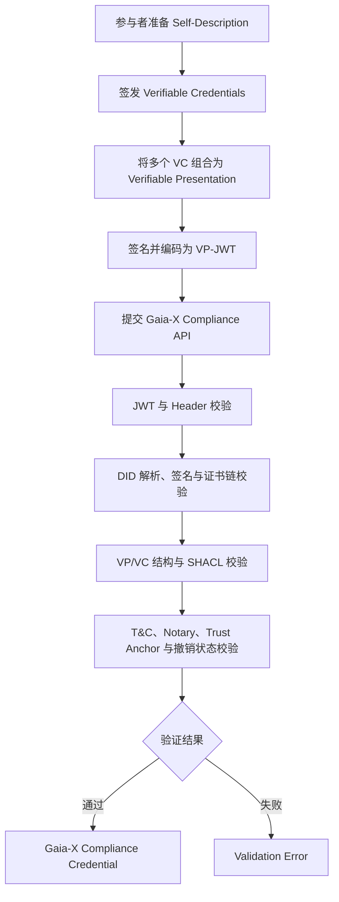

# DSSC Toolbox Research — Group B

> Gaia-X Compliance Service 与 Registry 调研：以建筑能耗数据产品为例，研究数据空间中的身份、信任与合规验证流程。

[](https://gaia-x.eu/)
[](#项目简介)
[](#当前进展)

## 项目简介

本仓库记录 DSSC Toolbox 小组研究项目及 B 组成果。整个项目围绕一个最小数据空间场景展开：

> 数据提供方 **Energy Data Provider Ltd.** 发布建筑小时级能耗数据；数据使用方 **City Analytics Lab** 发现并申请访问该数据产品；数据空间管理方要求参与者与服务具备统一语义描述，并经过信任、合规和元数据验证。

四个研究方向分别覆盖数据空间工具链的不同环节：

| 小组 | 研究方向 | 主要工具 |
|---|---|---|
| A 组 | 数据交换与连接器 | FIWARE Data Space Connector / TNO TSG |
| **B 组** | **信任与合规** | **Gaia-X Compliance Service / Registry** |
| C 组 | 语义模型治理 | Semantic Treehouse |
| D 组 | 一致性与约束验证 | Interoperability Test Bed / SEMIC SHACL Validator |

本仓库当前的主要成果来自 **B 组**，重点回答以下问题：

- Gaia-X Self-Description、VC、VP、SHACL、DID、Trust Anchor 和 Registry 如何协同工作？
- Compliance API 接受什么格式的输入，验证链按什么顺序执行？
- 虚构 Participant 为什么无法通过 Wizard 的 LRN 校验，而官方样例身份为何可以跑通？
- Registry 中的 shapes、信任锚、条款哈希和 Notary 信息如何影响验证？

## 研究场景

| 属性 | 值 |
|---|---|
| Data Product | Building Energy Consumption Dataset API |
| Dataset ID | `building-energy-hourly-v1` |
| Provider | Energy Data Provider Ltd. |
| Consumer | City Analytics Lab |
| Format | JSON |
| Frequency | Hourly |
| Unit | kWh |
| Spatial Coverage | Shenzhen demo district |
| Temporal Coverage | 2026-05-01 至 2026-05-02 |

场景包同时提供模拟业务数据、OpenAPI 描述、合法/非法 JSON-LD 元数据、SHACL shapes，以及 Gaia-X 参与者和服务描述模板，供各组在同一数据产品上开展研究。

## Gaia-X 合规验证流程



## 当前进展

### 已完成

- 梳理 Gaia-X Compliance Service、Registry 与 Trust Framework 的核心概念。
- 基于当前 Gaia-X 结构准备最小 `gx:LegalPerson` JSON-LD 凭证。
- 调研 Compliance API 的请求方法、Content-Type、请求体和响应格式。
- 实测裸 JSON-LD 与三段式伪 JWT 在 Compliance API 前置校验中的行为。
- 复测 Gaia-X Wizard v2.2.0 的非生产模式，确认虚构 LRN 仍会在 Legal Person 阶段被拒绝。
- 使用 Gaia-X 官方样例法人完成 `LegalPerson VC + T&C VC + LRN VC → VP-JWT → Compliance Credential` 端到端验证。
- 分析 Registry 中 SHACL shapes、Trust Anchors、T&C 与 Notary 在后续验证链中的作用。
- 整理 B 组与 A、C、D 组之间的输入、输出和集成关系。

### 核心发现

1. Compliance API 要求提交已签名的 **VP-JWT**，不能直接提交裸 JSON-LD。
2. 裸 JSON-LD 会在 JWT 解码阶段失败，因此无法触发后续 SHACL 内容校验。
3. 三段式伪 JWT 可以进入 Header 校验，并暴露缺少 issuer DID（`iss`）等更具体的问题。
4. Wizard 的非生产模式可代管密钥和 DID 流程，但不会绕过 Legal Registration Number（LRN）的真实性校验；虚构 Participant 与虚构 LRN 无法完成 onboarding。
5. 使用 Gaia-X 官方样例法人及有效 VAT 号后，已获得由 development Compliance Service 签发的 `gx:LabelCredential`（级别 `SC`），验证了技术链路可运行。
6. 正式合规仍依赖可解析的 DID 文档、有效签名和证书链、LRN、T&C Credential，以及可信的 Trust Anchor。

### 实测成功结果

| 项目 | 结果 |
|---|---|
| 测试日期 | 2026-08-09（UTC+8） |
| Participant | `Gaia-X European Association for Data and Cloud AISBL`（官方样例身份） |
| LRN | VAT `BE0762747721` |
| Compliance issuer | `did:web:compliance.lab.gaia-x.eu:development` |
| Compliance Engine | `2.12.0` |
| Rules version | `CD25.10` |
| Label level | `SC` |
| Validated criterion | `PA1.1` |

> **身份边界：**该成功结果属于 Gaia-X 官方样例法人，只证明 Wizard、Notary、VP-JWT 与 development Compliance API 的端到端技术链路可运行；它不能证明虚构的 `Energy Data Provider Ltd.` 已完成 Gaia-X onboarding 或取得合规身份。

### 仍待完成

- 为 `Energy Data Provider Ltd.` 准备真实、可验证的法人登记号。
- 为项目自己的 Participant 部署可公开解析的 `did:web` 文档，并建立可信签名与证书链。
- 为项目身份生成有效的 VC-JWT/VP-JWT，取得对应的 LRN 与 T&C Credentials。
- 保存并提交可复现的请求脚本、官方样例凭证原文和原始响应（如符合凭证与隐私管理要求）。
- 文档中的部分 SHACL 与 Trust Anchor 深层错误仍属于基于规范的分析预测，并非本轮失败路径的 API 实测结果。

## 仓库结构

```text
.
├── README.md
├── DSSC group b file/
│   ├── B_gaiax_concepts_revised_with_framework.md
│   ├── B_gaiax_validation_flow.md
│   ├── B_registry_role_analysis.md
│   └── 任务结果/
│       ├── B_compliance_api_demo.md
│       ├── failure_in_registry.md
│       ├── legal-person-minimal.jsonld
│       └── participant-fake.vp.jwt
└── DSSC_Tool_Learning/
    ├── DSSC_Toolbox_Research_Task_Plan.md
    ├── DSSC_Toolbox_Scenario.md
    └── DSSC_Minimal_Energy_Scenario/
        ├── README.md
        ├── VALIDATION_GUIDE.md
        ├── data/
        ├── gaia-x/
        ├── metadata/
        ├── mock-api/
        └── shapes/
```

### 主要文档

| 文档 | 内容 |
|---|---|
| [`B_gaiax_concepts_revised_with_framework.md`](DSSC%20group%20b%20file/B_gaiax_concepts_revised_with_framework.md) | Self-Description、VC、VP、SHACL、DID、Trust Anchor、Registry 等概念 |
| [`B_gaiax_validation_flow.md`](DSSC%20group%20b%20file/B_gaiax_validation_flow.md) | 从凭证准备到 Compliance Credential 的完整验证流程及证据状态 |
| [`B_registry_role_analysis.md`](DSSC%20group%20b%20file/B_registry_role_analysis.md) | Registry 的定位、数据类型及其与 Compliance Service 的边界 |
| [`B_compliance_api_demo.md`](DSSC%20group%20b%20file/%E4%BB%BB%E5%8A%A1%E7%BB%93%E6%9E%9C/B_compliance_api_demo.md) | 最小 LegalPerson 凭证设计与 Compliance API 测试记录 |
| [`failure_in_registry.md`](DSSC%20group%20b%20file/%E4%BB%BB%E5%8A%A1%E7%BB%93%E6%9E%9C/failure_in_registry.md) | API 错误、Registry 条目与验证层级的映射分析 |
| [`legal-person-minimal.jsonld`](DSSC%20group%20b%20file/%E4%BB%BB%E5%8A%A1%E7%BB%93%E6%9E%9C/legal-person-minimal.jsonld) | 教学用途的最小 `gx:LegalPerson` 凭证样例 |
| [`participant-fake.vp.jwt`](DSSC%20group%20b%20file/%E4%BB%BB%E5%8A%A1%E7%BB%93%E6%9E%9C/participant-fake.vp.jwt) | 虚构 Participant 的实验 VP-JWT；仅用于分析失败路径，不代表有效合规凭证 |

## 如何使用

本仓库以研究文档和数据样例为主，无需构建或安装依赖。

```bash
git clone https://github.com/MaxVer11111/DSSC-project.git
cd DSSC-project
```

推荐阅读顺序：

1. 阅读 [`DSSC_Toolbox_Scenario.md`](DSSC_Tool_Learning/DSSC_Toolbox_Scenario.md)，了解统一场景和各组分工。
2. 阅读 B 组概念文档，理解 Gaia-X 信任与合规术语。
3. 查看最小 LegalPerson 凭证样例及 API Demo 报告。
4. 阅读 Demo 报告中的两条 Wizard 路径，对比虚构 LRN 的失败与官方样例身份的成功结果。
5. 结合 Validation Flow 和 Registry 分析，区分已实测结果、规范推导和外部依赖。

如需检查仓库中的 JSON/JSON-LD 文件是否满足基本 JSON 语法，可运行：

```bash
python -m json.tool "DSSC group b file/任务结果/legal-person-minimal.jsonld"
```

> 注意：通过 JSON 语法检查不等于通过 JSON-LD、SHACL 或 Gaia-X 合规验证。

## 局限与注意事项

- `legal-person-minimal.jsonld` 是教学样例，包含占位域名和 DID，不可直接用于生产环境。
- `participant-fake.vp.jwt` 是失败路径实验材料，不应被当作可验证身份或生产凭证使用。
- 场景中的 API Endpoint、组织身份和注册号均为演示数据。
- 不要将 HTTP `400` 的前置格式错误理解为完整 Gaia-X 合规验证结果。
- 成功的 Compliance Credential 绑定 Gaia-X 官方样例法人，不绑定本项目虚构的能源数据提供方。
- Compliance Service、Registry、ontology 与 Trust Framework 会持续演进；复现实验前应核对当前官方版本和接口文档。
- 仓库目前未提供独立的开源许可证文件；除场景中明确标注的演示数据外，请勿自行推定代码或文档的复用许可。

## 后续工作

- 为项目 Participant 准备真实法人身份与可验证 LRN。
- 部署真实可解析的 `did:web` 文档及 verification method。
- 使用可信密钥和证书生成项目身份的 VC-JWT，并组合、签名 VP-JWT。
- 获取项目身份对应的 LRN 与 T&C Credentials。
- 将正确与错误凭证推进到 SHACL、Trust Anchor 和 Notary 校验层。
- 保存可复现的请求脚本、原始响应和验证时间戳。
- 与 A、C、D 组产物集成，形成完整的 data space onboarding demo。

## 参考资料

- [Gaia-X 官方网站](https://gaia-x.eu/)
- [Gaia-X Trust Framework](https://gaia-x.gitlab.io/policy-rules-committee/trust-framework/)
- [Gaia-X Ontology](https://docs.gaia-x.eu/ontology/development/)
- [Gaia-X Architecture Document](https://docs.gaia-x.eu/technical-committee/architecture-document/)
- [W3C Verifiable Credentials Data Model](https://www.w3.org/TR/vc-data-model-2.0/)
- [W3C SHACL](https://www.w3.org/TR/shacl/)

## 贡献

欢迎通过 Issue 或 Pull Request 补充实验记录、修正文档，或完善可复现的合规验证流程。提交实验结果时，请同时注明使用的规范版本、接口地址、测试时间、请求格式和原始响应。
