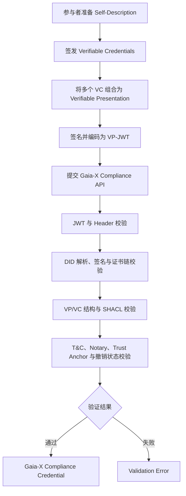

# DSSC Toolbox Research — Group B

> Gaia-X Compliance Service 与 Registry 调研：以建筑能耗数据产品为例，研究数据空间中的身份、信任与合规验证流程。

[](https://gaia-x.eu/)
[](#项目简介)
[](#当前进展)

## 项目简介

本仓库记录 DSSC Toolbox 小组研究项目及 B 组成果。整个项目围绕一个最小数据空间场景展开：

> 数据提供方 **Energy Data Provider Ltd.** 发布建筑小时级能耗数据；数据使用方 **City Analytics Lab** 发现并申请访问该数据产品；数据空间管理方要求参与者与服务具备统一语义描述，并经过信任、合规和元数据验证。

四个研究方向分别覆盖数据空间工具链的不同环节：

| 小组 | 研究方向 | 主要工具 |
|---|---|---|
| A 组 | 数据交换与连接器 | FIWARE Data Space Connector / TNO TSG |
| **B 组** | **信任与合规** | **Gaia-X Compliance Service / Registry** |
| C 组 | 语义模型治理 | Semantic Treehouse |
| D 组 | 一致性与约束验证 | Interoperability Test Bed / SEMIC SHACL Validator |

本仓库当前的主要成果来自 **B 组**，并已从概念调研推进到凭证、API 与前端集成演示，重点回答以下问题：

- Gaia-X Self-Description、VC、VP、SHACL、DID、Trust Anchor 和 Registry 如何协同工作？
- Compliance API 接受什么格式的输入，验证链按什么顺序执行？
- 虚构 Participant 为什么无法通过 Wizard 的 LRN 校验，而官方样例身份为何可以跑通？
- Registry 中的 shapes、信任锚、条款哈希和 Notary 信息如何影响验证？
- 如何用 ES256 VC/VP、DID `x5u` 证书链和无效用例复现各层验证结果？

## 研究场景

| 属性 | 值 |
|---|---|
| Data Product | Building Energy Consumption Dataset API |
| Dataset ID | `building-energy-hourly-v1` |
| Provider | Energy Data Provider Ltd. |
| Consumer | City Analytics Lab |
| Format | JSON |
| Frequency | Hourly |
| Unit | kWh |
| Spatial Coverage | Shenzhen demo district |
| Temporal Coverage | 2026-05-01 至 2026-05-02 |

场景包同时提供模拟业务数据、OpenAPI 描述、合法/非法 JSON-LD 元数据、SHACL shapes，以及 Gaia-X 参与者和服务描述模板，供各组在同一数据产品上开展研究。

## Gaia-X 合规验证流程



## 当前进展

### 已完成

- 梳理 Gaia-X Compliance Service、Registry 与 Trust Framework 的核心概念。
- 对齐 A 组 Demo 身份、公开 DID、ES256 密钥和最终 Dataset URI。
- 生成 LegalPerson、ServiceOffering JSON-LD、两份 VC-JWT 及一份 VP-JWT。
- 完成本地一致性检查、JWT 解码、DID 解析、ES256 验签及 SHA-256 证据。
- 构造 INV-01～INV-07 无效测试集，覆盖内容、时间、一致性、SHACL 和签名错误。
- 完成三轮 Compliance API 测试，并保存六组原始响应和对比报告。
- 使用 DID 文档中的 `x5u` 外部 PEM 证书链穿透 L3 信任锚校验，进入 L5+ 内容校验。
- 提供 React + Vite 单页 Demo，可实时提交测试 VP-JWT；遇到网络、CORS 或超时时回退到保存响应。
- 分析 Registry 中 SHACL shapes、Trust Anchors、T&C 与 Notary 在后续验证链中的作用。
- 完成 B 组最终总结与 Credential 集成干净交付包。

### 核心发现

1. Compliance API 要求提交已签名的 **VP-JWT**，不能直接提交裸 JSON-LD。
2. 可解析 DID 与 JWK 仍不足以建立 Gaia-X 信任，服务还需要可用的 X.509 证书链。
3. 本次实验中，`x5u → PEM` 成功通过服务端证书解析与信任链检查，而内嵌 `x5c` 未能通过。
4. JWT、签名和信任层通过后，SHACL、跨凭证一致性、Labelling、LRN 与 T&C 错误才会显现。
5. 当前成果是教学/实验级验证链，不是生产级 Gaia-X onboarding 或合规认证。

### 第三轮 API 结果（2026-08-18）

| 用例 | 结果 | 最深层级 | 关键观察 |
|---|---|---|---|
| VALID | HTTP 400 | L5/L6/L7 | L1～L4 通过；仍缺 SHACL/Labelling 字段、LRN 与 Issuer T&C |
| INV-01 | HTTP 400 | L5+ | 检测到 `gx:legalName` 差异 |
| INV-02 | HTTP 400 | L5+ | 明确检测到 VC 已过期 |
| INV-03 | HTTP 400 | L5/L6 | 明确检测到 issuer/provider 不一致 |
| INV-04 | HTTP 400 | L5+ | 检测到错误 Dataset URI |
| INV-07 | HTTP 400 | L2 | 明确返回签名验证失败 |

> 这里的 `VALID` 表示“本项目的有效基线测试用例”，即本地结构与签名有效；它不表示已经取得 Gaia-X Compliance Credential。

### 仍待完成

- 增加可信的 LRN Credential 与 `gx:Issuer` Terms & Conditions Credential。
- 补齐 ServiceOffering 的法律文档、安全措施和 Gaia-X Labelling Criteria 字段。
- 修复剩余 SHACL Closed/MinCount 约束并再次提交有效基线。
- 将实时测试、响应归档及服务版本信息纳入自动化回归。

## 仓库结构

```text
.
├── README.md
├── DSSC group b file/
│   ├── DSSC_GroupB_Final_Summary.md
│   ├── B_gaiax_concepts_revised_with_framework.md
│   ├── B_gaiax_validation_flow.md
│   ├── B_registry_role_analysis.md
│   ├── B_compliance_api_demo.md
│   ├── 任务结果/
│   │   ├── wizard-output/
│   │   └── run-compliance-demo.ps1
│   └── final demo/
│       ├── api-test-report-r3.md
│       ├── api-responses/
│       ├── frontend-demo/
│       ├── 最终版（最终干净交付物）/
│       └── 原版（完整工作痕迹）/
└── DSSC_Tool_Learning/
    ├── DSSC_Toolbox_Research_Task_Plan.md
    ├── DSSC_Toolbox_Scenario.md
    ├── B-gaia-x-study-guide.html
    └── DSSC_Minimal_Energy_Scenario/
        ├── README.md
        ├── VALIDATION_GUIDE.md
        ├── data/
        ├── gaia-x/
        ├── metadata/
        ├── mock-api/
        └── shapes/
```

### 主要文档

| 文档 | 内容 |
|---|---|
| [`DSSC_GroupB_Final_Summary.md`](DSSC%20group%20b%20file/DSSC_GroupB_Final_Summary.md) | 小组分工、两阶段成果、跨组集成、主要发现与限制 |
| [`B_gaiax_concepts_revised_with_framework.md`](DSSC%20group%20b%20file/B_gaiax_concepts_revised_with_framework.md) | Self-Description、VC、VP、SHACL、DID、Trust Anchor、Registry 等概念 |
| [`B_gaiax_validation_flow.md`](DSSC%20group%20b%20file/B_gaiax_validation_flow.md) | 从凭证准备到 Compliance Credential 的完整验证流程及证据状态 |
| [`B_registry_role_analysis.md`](DSSC%20group%20b%20file/B_registry_role_analysis.md) | Registry 的定位、数据类型及其与 Compliance Service 的边界 |
| [`B_compliance_api_demo.md`](DSSC%20group%20b%20file/B_compliance_api_demo.md) | 最小 LegalPerson 凭证设计与 Compliance API 测试记录 |
| [`api-test-report-r3.md`](DSSC%20group%20b%20file/final%20demo/api-test-report-r3.md) | x5u 方案、六用例响应矩阵及三轮测试对比 |
| [`frontend-demo/README.md`](DSSC%20group%20b%20file/final%20demo/frontend-demo/README.md) | React + Vite 演示界面的运行、构建与回退机制 |
| [`Credential 最终交付包`](DSSC%20group%20b%20file/final%20demo/%E6%9C%80%E7%BB%88%E7%89%88%EF%BC%88%E6%9C%80%E7%BB%88%E5%B9%B2%E5%87%80%E4%BA%A4%E4%BB%98%E7%89%A9%EF%BC%89/%E6%88%90%E5%91%982-Credential%E9%9B%86%E6%88%90-v0.3-es256-candidate-FINAL-20260817/README.md) | ES256 凭证、无效用例、验证证据与复核步骤 |
| [`failure_in_registry.md`](DSSC%20group%20b%20file/%E4%BB%BB%E5%8A%A1%E7%BB%93%E6%9E%9C/failure_in_registry.md) | API 错误、Registry 条目与验证层级的映射分析 |
| [`legal-person-minimal.jsonld`](DSSC%20group%20b%20file/%E4%BB%BB%E5%8A%A1%E7%BB%93%E6%9E%9C/legal-person-minimal.jsonld) | 教学用途的最小 `gx:LegalPerson` 凭证样例 |
| [`participant-fake.vp.jwt`](DSSC%20group%20b%20file/%E4%BB%BB%E5%8A%A1%E7%BB%93%E6%9E%9C/participant-fake.vp.jwt) | 虚构 Participant 的实验 VP-JWT；仅用于分析失败路径，不代表有效合规凭证 |

## 如何使用

阅读研究文档无需安装依赖；运行前端 Demo 需要 Node.js/npm，复核 ES256 凭证需要 Python 及 `cryptography`。

```bash
git clone https://github.com/MaxVer11111/DSSC-project.git
cd DSSC-project
```

### 运行可视化 Demo

```powershell
cd "DSSC group b file/final demo/frontend-demo"
npm install
npm run dev
```

生产构建与自检：

```powershell
npm run build
npm run verify
npm run preview
```

`predev` 和 `prebuild` 会按显式允许列表复制六份预签名 VP-JWT 与历史响应，不会复制教学 Demo 私钥。

### 复核 ES256 Credential 交付包

进入以下目录：

```text
DSSC group b file/final demo/最终版（最终干净交付物）/成员2-Credential集成-v0.3-es256-candidate-FINAL-20260817
```

运行一致性检查与验签：

```powershell
py -c "import cryptography; print(cryptography.__version__)"
powershell -NoProfile -ExecutionPolicy Bypass -File .\scripts\check-consistency.ps1
py .\scripts\verify-es256-candidate-jwts.py
```

如需重新生成 JWT，再执行：

```powershell
py .\scripts\build-es256-candidate-jwts.py
py .\scripts\verify-es256-candidate-jwts.py
```

重建会按运行时间生成新的有效期、签名和哈希；应以重建后的新哈希清单为准。

推荐阅读顺序：

1. 阅读 [`DSSC_Toolbox_Scenario.md`](DSSC_Tool_Learning/DSSC_Toolbox_Scenario.md)，了解统一场景和各组分工。
2. 阅读 [`DSSC_GroupB_Final_Summary.md`](DSSC%20group%20b%20file/DSSC_GroupB_Final_Summary.md)，了解两阶段成果和跨组集成。
3. 阅读 B 组概念文档、Validation Flow 与 Registry 分析。
4. 查看 Credential 最终交付包，理解 VC/VP、无效用例及本地验证证据。
5. 阅读第三轮 API 报告，对比 L2、L3、L5/L6/L7 的实际响应。
6. 运行前端 Demo，交互查看实时或已保存的六用例结果。

如需检查仓库中的 JSON/JSON-LD 文件是否满足基本 JSON 语法，可运行：

```bash
python -m json.tool "DSSC group b file/任务结果/legal-person-minimal.jsonld"
```

> 注意：通过 JSON 语法检查不等于通过 JSON-LD、SHACL 或 Gaia-X 合规验证。

## 局限与注意事项

- `legal-person-minimal.jsonld` 是教学样例，包含占位域名和 DID，不可直接用于生产环境。
- `participant-fake.vp.jwt` 是失败路径实验材料，不应被当作可验证身份或生产凭证使用。
- 当前有效基线仍未通过最终 Compliance，主要缺少完整 Labelling 字段、可信 LRN Credential 与 Issuer T&C Credential。
- Demo 注册号 `DEMO-ENERGY-001` 不能替代 Notary 签发的真实 Legal Registration Number Credential。
- 场景中的 DID、证书、组织身份和注册号均为教学演示数据。
- 不要将 HTTP `400` 的前置格式错误理解为完整 Gaia-X 合规验证结果。
- `VALID` 仅指本地签名与结构有效的基线用例，不代表已取得 Compliance Credential。
- 最终交付包保留 A 组公开的虚构主体教学 Demo 私钥以支持复现；不得将它用于真实身份、资产或生产环境。
- 历史目录用于保留迭代证据；复现和展示应优先使用“最终版（最终干净交付物）”。
- 实时 Demo 受网络、CORS、端点可用性和服务版本影响；只有这些条件异常时才回退到 2026-08-18 保存的响应。
- Compliance Service、Registry、ontology 与 Trust Framework 会持续演进；复现实验前应核对当前官方版本和接口文档。
- 仓库目前未提供独立的开源许可证文件；除场景中明确标注的演示数据外，请勿自行推定代码或文档的复用许可。

## 后续工作

- 增加可信的 LRN Credential 与 `gx:Issuer` Terms & Conditions Credential。
- 补齐 ServiceOffering 的法律文档、安全措施及 Labelling Criteria 字段。
- 修复剩余 SHACL Closed/MinCount 约束并再次提交有效基线。
- 将实时 API 测试、响应归档和服务版本信息纳入自动化回归。
- 与 A、C、D 组产物进一步集成为完整的 data space onboarding demo。

## 参考资料

- [Gaia-X 官方网站](https://gaia-x.eu/)
- [Gaia-X Trust Framework](https://gaia-x.gitlab.io/policy-rules-committee/trust-framework/)
- [Gaia-X Ontology](https://docs.gaia-x.eu/ontology/development/)
- [Gaia-X Architecture Document](https://docs.gaia-x.eu/technical-committee/architecture-document/)
- [W3C Verifiable Credentials Data Model](https://www.w3.org/TR/vc-data-model-2.0/)
- [W3C SHACL](https://www.w3.org/TR/shacl/)

## 贡献

欢迎通过 Issue 或 Pull Request 补充实验记录、修正文档，或完善可复现的合规验证流程。提交实验结果时，请同时注明使用的规范版本、接口地址、测试时间、请求格式和原始响应。
